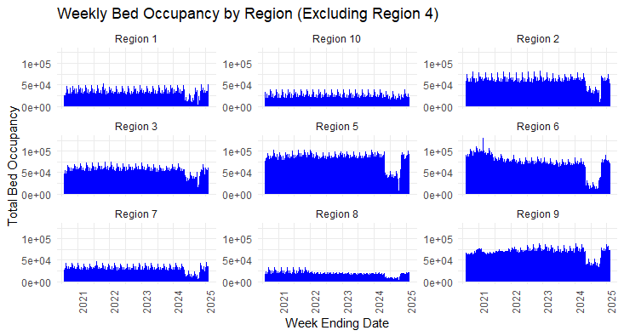
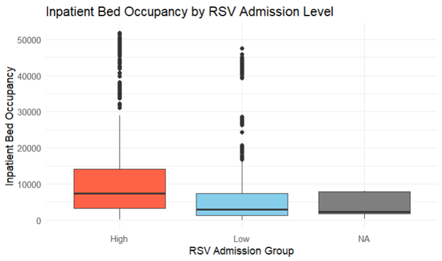
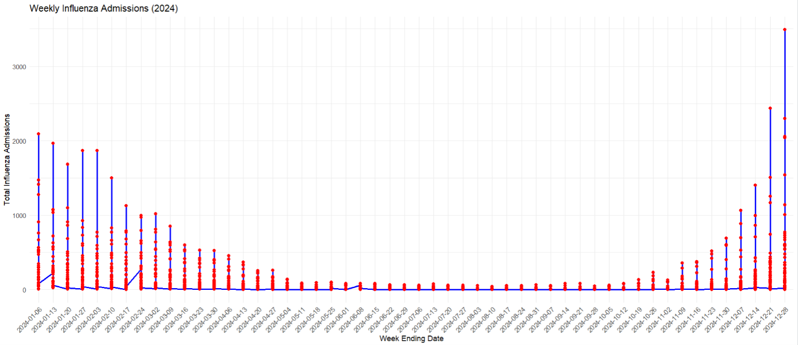
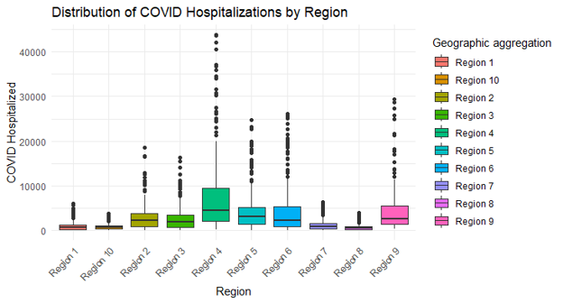

# 🏥 Hospital Bed Occupancy Analysis


---

## 📌 Project Overview

Efficient hospital capacity planning is essential for maintaining high-quality patient care, especially during periods of increased demand caused by infectious diseases such as COVID-19, Influenza, and RSV.

This project analyzes **weekly hospital bed occupancy trends across the United States** using publicly available healthcare data from the **CDC National Healthcare Safety Network (NHSN)**. The objective was to uncover patterns in hospital utilization, evaluate relationships between respiratory illnesses and inpatient bed occupancy, and provide data-driven insights that could support healthcare resource planning and operational decision-making.

---

## 🎯 Business Problem

Healthcare organizations must anticipate fluctuations in patient demand to allocate staff, beds, and medical resources efficiently.

The goal of this analysis was to answer questions such as:

- Which respiratory diseases place the greatest burden on hospital capacity?
- Do higher RSV admissions significantly increase inpatient bed occupancy?
- How do hospitalization trends change over time and across regions?
- How can statistical analysis support healthcare planning and resource allocation?

---

## 📊 Dataset

**Source**

CDC National Healthcare Safety Network (NHSN)

The original dataset contains weekly hospital occupancy information collected across the United States, including:

- Inpatient bed occupancy
- ICU occupancy
- COVID-19 admissions
- Influenza admissions
- RSV admissions
- Geographic regions
- Weekly reporting dates

---

## 🛠️ Tools & Technologies

- **R**
- **dplyr**
- **ggplot2**
- **lubridate**
- Statistical Analysis
- Data Cleaning
- Hypothesis Testing
- Regression Analysis

---

## 🔎 Project Workflow

### 1️⃣ Data Cleaning

- Removed observations with excessive missing values
- Selected variables relevant to the business questions
- Handled missing values
- Identified and investigated potential outliers
- Created cleaned datasets for analysis

---

### 2️⃣ Exploratory Data Analysis

Explored hospital occupancy trends across regions and over time using descriptive statistics and visualizations.

---

### 3️⃣ Statistical Analysis

Performed multiple statistical techniques including:

- Descriptive Statistics
- Independent t-Test
- ANOVA
- Regression Analysis

to evaluate relationships between respiratory illnesses and hospital occupancy.

---

### 4️⃣ Data Visualization

Created multiple visualizations to better understand trends and communicate findings, including:

- COVID-19 regional heatmaps
- Weekly influenza trends
- Bed occupancy trends
- Boxplots comparing RSV admission groups

---

# 📈 Key Findings

✅ Hospitals with higher RSV admissions experienced significantly higher inpatient bed occupancy.

✅ COVID-19 created the largest burden on hospital resources during the study period.

✅ Hospital occupancy varied considerably across U.S. regions and over time.

✅ Statistical analysis highlighted how infectious disease trends can support proactive healthcare planning and resource allocation.

---

# 🖼️ Visualizations

## COVID-19 Hospitalizations by Region


---

## Bed Occupancy Trends



---

## RSV Admissions vs Inpatient Bed Occupancy



---

## Weekly Influenza Admissions



---

## Regional Comparison



---

# 📂 Repository Structure

```
hospital-bed-occupancy-analysis/
│
├── code/
│   └── analysis.R
│
├── data/
│   ├── raw_data.csv
│   ├── cleaned_data.csv
│
├── images/
│
├── presentation/
│   └── Presentation.pdf
│
├── report/
│   └── Final_Report.pdf
│
└── README.md
```

---

# 🚀 Skills Demonstrated

- Healthcare Analytics
- Business Analytics
- Statistical Analysis
- Data Cleaning
- Exploratory Data Analysis (EDA)
- Data Visualization
- Hypothesis Testing
- Regression Analysis
- Data Storytelling
- Healthcare Resource Planning

---

# 📄 Project Documentation

Additional project details can be found in:

- 📑 Final Report
- 📊 Project Presentation
- 💻 R Source Code

---

## 👩‍💻 Author

**Narjis Jebali Giacalone**

🔗 www.linkedin.com/in/narjis-giacalone

M.S. Business Analytics

Elon University

2025
